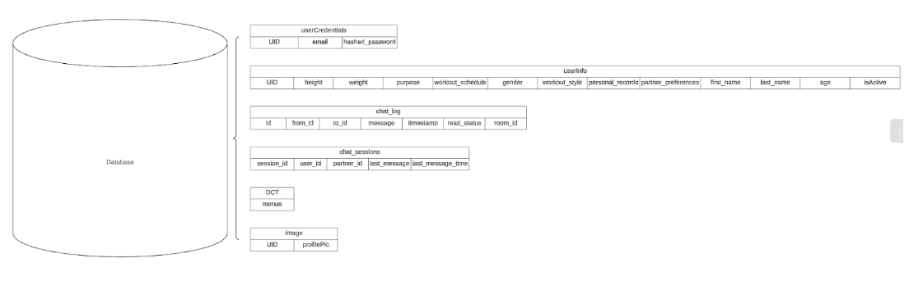
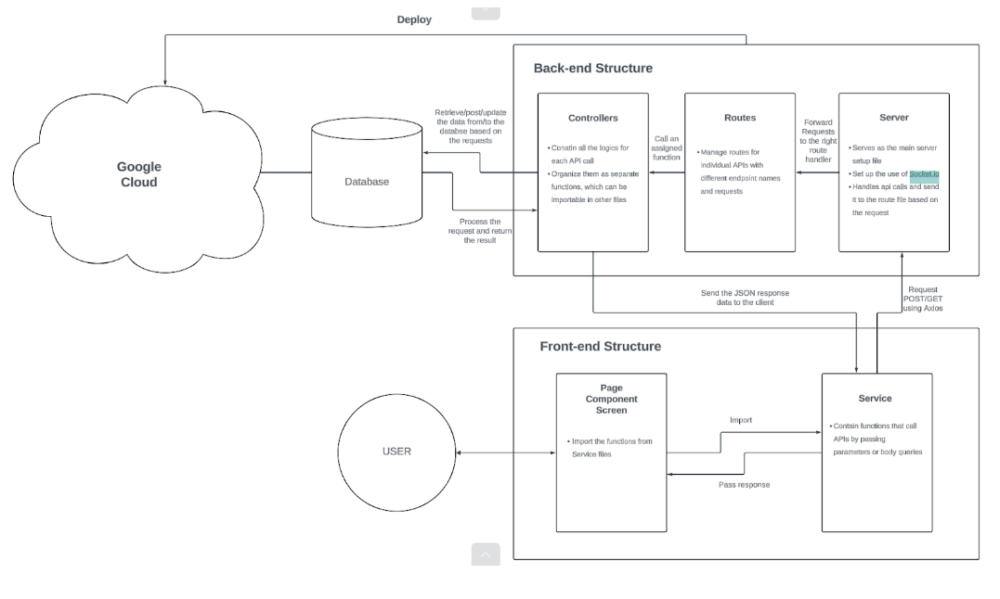

# FitUp 
The ultimate workout app for Emory students! FitUp is an Emory specific health app which not only helps the Emory students or faculties find their ideal gym partner and match them but also inform each user’s targeted daily intake for each nutrition and suggest the DCT menu recommendation based on their profile. This document covers how to install the FitUp app, how to use all the features in the app, and how to troubleshoot the common errors in the app. 

# Informational Video 
[Click here to watch an informational video about FitUp!](https://drive.google.com/file/d/1eDBB3JA3QEpA073dj95hwSBH8XZ62sn6/view?usp=sharing)

# Installation Instruction 
You can follow the instructions on this website for your device platform [here!](https://spar926.wixsite.com/fitup)

# User Manuals 
### Getting Started 
After downloading the FitUp app, begin by signing up with your Emory email account. Enter your email, create a password, and consent to data collection. You’ll then receive a verification code via email; once verified, you can complete your registration.

Next, fill out your profile with detailed information including your name, gender, age, height, weight, personal records, workout goals, schedule, and preferred styles. The more specific you are, the better your chances of finding an ideal gym partner.

### After Registration
Upon signing in, you'll be directed to the homepage where you can see a list of potential gym partners, ranked by compatibility. Click on a user’s profile to view their specific details like height, weight, and workout schedule. If you're interested in connecting, simply hit the chat button to start a conversation and potentially arrange a workout.

For more tailored results, use the filter button on the homepage. This feature lets you specify preferences for gender, personal records, workout schedules, and goals. Adjusting these filters will refresh your homepage with a list more aligned with your preferences. You can also choose to hide your profile from other users by deactivating the active button in the top right of the homepage.

### Navigation Buttons
The app includes four main navigation buttons:
Home: Returns you to the homepage to browse potential partners.
Chat: Open your previous conversations.
Menu: Displays your targeted nutritional goals (calories, carbohydrates, proteins, fats) based on your profile data. Follow the suggested DCT menu recommendations to meet these goals. Note: Cox menu recommendations will be available once Emory provides specific nutritional details.
Profile: Allows you to edit your settings, contact FitUp support, logout, or delete your account.

### Diet Recommendation Explained
Specifically for the menu page, you can get your targeted calories, carbohydrates, protein, and fat which is calculated based on your age, height, weight, gender, and your workout purpose. You can follow that targeted nutrition to achieve your workout goal. Below that, you also have a detailed DCT menu recommendation, which is made based on your targeted nutrition. When you follow the diet plan provided, you will achieve your targeted nutrition. The recommendations are based on the DCT menus updated everyday, and you can click each modal for the specific nutrition information about each specific menu. The Cox menu recommendations are not provided yet since Emory does not provide specific nutrition information about Cox menus in the website, but it will soon be updated. 

# Common Troubleshooting Guides
### Menu Page loading
The menu page takes time to load the data for your targeted calories and the DCT menu recommendation, since the app is feeding your targeted nutrition information to openai api to get the recommendation based on it. It will take more than 20 seconds, so when you just wait, the page will be loaded. 

# Contact 
For more information or details, contact emoryfitup@gmail.com!

# Developer Documentation
If you want to use our codebase for development, please refer to the following: 
1. Run `git clone https://github.com/yoo-nathan/FitUp.git`
2. Navigate to the cloned folder
3. Then, run the following commands:

   i. `cd ./FitUpBack/`
   
   ii. `npm install`
   
   iii. `cd ../FitUpFront/`
   
   iv. `npm install`
   
   v. To launch the app run `npx expo start` and scan the QR code with a mobile device using the Expo Go app.

## Tech stack: 
- Front-end: React Native
- Back-end: Node JS, Python
- Database: MySQL

## Registration and Sign-In system:
   In our Emory-specific fitness app, user registration is restricted to those with an "@emory.edu" email address. This ensures that only Emory students and faculty can access the app. During registration, users must enter their Emory email and a password. We then send a verification email through node-mailer, which includes a 5-digit code to confirm the validity of the email address. Upon verification, users are prompted to provide additional necessary and optional personal information to enhance their app experience.
   User data is securely stored in two separate MySQL databases: userCredentials and userInfo. The userCredentials database holds the email, encoded password, and a unique user ID (UID). The userInfo database captures detailed personal information such as height, weight, and gym records.
   For password security, we use bcrypt, a robust hashing function from Node.js, to encode passwords. This UID is essential for identifying users during API calls from the client side.
   For signing in, we utilize tokens generated by jsonwebtoken. These tokens contain the UID in their payload and are encrypted with a secret key to bolster security. The tokens are designed to expire after a pre-determined period, enhancing the security of our app. Once a user successfully signs in, the token is temporarily stored in AsyncStorage. This setup enables front-end developers to use authentication middleware to decode the token and retrieve the UID necessary for making API calls.

## Gym partner list-up:
Aligning with our primary goal of facilitating the best matches for gym partners, our app displays a dynamically updated list of users who have marked themselves as active using a toggle button on the main page. This feature is designed to streamline the process of finding the ideal gym companion without the need to delve into detailed profiles and also guarantees privacy by allowing them to change their active status.
	Users can refine their search for gym partners based on criteria like similar personal records, gender, workout purpose, and preferred workout times. This approach reduces the need for excessive scrolling and enhances user convenience.
	Our sophisticated filter system not only applies the selected filters but also ranks the users based on a similarity score. For each matching filter option, the score for a user increases by one point. This score ranges from 0 to 4, allowing users to quickly identify the most compatible gym partners based on shared preferences. The list is sorted by this score, ensuring that the most relevant matches are displayed prominently.
	Once clicking it, each user card shows detailed profile information, providing further insights into each user. Additionally, from this interface, users can choose to initiate a chat, making it easy to connect directly with potential partners.
The backend supports this feature through several APIs:
Filter API: Includes logic for calculating the similarity score and applying user-selected filters.
Active Status Update API: Ensures that users can update the visibility of their profile to other users.
Chat-Initiating API: Facilitates communication between users by allowing them to start conversations directly from the detailed view of each profile.

## Chat system
   Our FitUp app features a comprehensive chat system that is integral for users to communicate effectively and determine if they are compatible gym partners. Users can initiate real-time conversations only through the detailed view of an active user’s profile. Once a conversation starts, users can exchange messages in real time, view timestamps of sent messages, and monitor the number of unread messages on the chat list screen. This list is dynamically sorted by the most recent interactions, updating in real time as new messages are received.
   The implementation of these interactive chat features is powered by Socket.io, a library that facilitates real-time, bi-directional communication between clients and servers, overcoming the limitations of standard HTTP's one-way communication. With Socket.io, using "on" to listen for events and "emit" to send messages, our system handles real-time data transmission efficiently. Moreover, all chat-related data is meticulously managed within two dedicated database tables: chat_log and chat_sessions. chat_log stores detailed chat histories, marked by unique chatroom IDs, and includes sender and receiver IDs, messages, timestamps, and unread statuses. chat_sessions maintains the latest message data, including timestamps and user IDs, ensuring that information is current and accessible during user interactions. This structure ensures that our chat system is both robust and responsive, enhancing user engagement and support throughout their fitness journey.

## BMR calculation and DCT menu recommendation:
   The FitUp app also provides a specialized feature that generates customized DCT diet plans for each user, tailored to their specific nutritional needs. It starts by fetching the user’s essential details such as height, weight, age, gender, and workout objectives from the database. Using these details, the app first calculates the Basal Metabolic Rate (BMR) using a recognized formula. This rate represents the number of calories needed for the body to perform basic life-sustaining functions like breathing and circulation when at rest. Next, the calculation extends to the Total Daily Energy Expenditure (TDEE), which adjusts the BMR based on the user's activity level derived from their workout schedule. This gives a more accurate measure of the total calories needed daily, considering the physical activities performed.To further refine the calorie estimate, the app adjusts the TDEE based on the specific workout goals of the user. For instance, calorie requirements might be increased for muscle gain or reduced for fat loss, aligning with the user's fitness objectives.
   With the targeted daily intake of calories, carbohydrates, proteins, and fats established, the app then recommends a daily diet plan. This plan is dynamically generated each day by scraping the DCT menu from its official website using BeautifulSoup, which then stores these menus in the database. The FitUp app integrates with the OpenAI API, which processes the user's nutritional targets along with the stored DCT menu information to produce a list of menu recommendations that exactly meet the calculated nutritional needs. Each item in the diet plan is chosen to ensure that the sum of calories and other nutrients precisely matches the user’s targeted daily intake. Users can view detailed nutritional information for each menu item by clicking on the menu cards provided within the app. This feature not only enhances user engagement by providing tailored dietary suggestions but also supports users in achieving their specific health and fitness goals efficiently.

## Profile section:
   The profile section is a vital interface where the users can provide their personal information about the height, weight, and the preferred workout schedule. As such, we implemented a dedicated API which issues the SQL command UPDATE to update the user information in the database. This ability is crucial for keeping the effectiveness of our app's platform for filtering and sorting users for whom it relies on reliable and current data in order to match them properly.
   These users may quickly modify the settings of their profiles and promptly save the changes with just a touch of a button. This ensures that their preferences and personal data is always updated. In addition to that, we have implemented a log-out feature that makes the user's security and privacy better by removing the user's authentication token from AsyncStorage. The user is effectively logged out of the system, rejecting unauthorized access and preserving session integrity. This blend of characteristics guarantees that the application remained easy-to-use, secure, and highly functional, serving the diverse fitness community.

## Database Structure 

## Architectural Diagram

